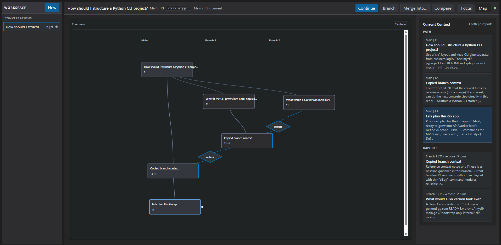

# Codex UI Wrapper

If you are anything like me, your conversations with AI often have decisions, questions, side-quests and contradictions alongside genuine prompts. 
AI chatbots are usually linear, and so context is wasted on follow-up questions and digressions. 
I try to transform linear AI conversations into graphs, allowing users to branch, compare, and recombine reasoning without losing context. 
The user can experiment safely, track reasoning paths, and reuse useful context rather than restarting, manually copying information between chats or suffering context bloat. 
The result is a workflow *closer* to version control for AI thinking. 


### UI Example





Therefore, I have made a local-only wrapper around `codex app-server` with:
- FastAPI REST API plus WebSocket replay/live stream
- SQLite persistence for threads, turns, events, approvals, and import previews
- Browser UI for conversation selection, direct DAG-driven child-turn creation, chat-style transcripts, and inline approvals
- Explicit approval flow only, never auto-approved

## Terms

- Conversation: the full tree rooted at the first branch.
- Main: the root branch of a conversation.
- Branch: any continuation line within the conversation DAG, labeled `Main`, `Branch 1`, `Branch 2`, and so on.
- Turn: one user prompt plus the assistant work and resulting response for that step.

## Current UI

- Left sidebar: compact conversation rows with branch/turn counts and status dots
- Header: one-line conversation title plus current `Main / Branch n` label, active workspace folder chip, mode toggle, and connection-status dot
- Visual system: flat neutral surfaces, thin borders, low-radius shapes, and accent color reserved mainly for active/imported/running states
- Focus mode: explicit `Continue`, `Branch`, `Merge Into...`, and `Compare` actions above a `Current Context` panel plus the active branch transcript
- Map mode: zoomable and pannable vertical DAG with prompt-summary boxes, draggable branch lanes, stable click-vs-drag node interaction, solid lineage edges, dashed imported-context edges, and drag handles for child-turn creation or merge-back into another branch head
- Transcript: chat-style flow with right-aligned user bubbles, left-aligned assistant bubbles, inherited/imported rows retained with subtle shading and `↳` lineage markers, per-message 2-line clamp with tiny left-aligned `more/less` toggles, and left-aligned `Reasoning`/`Commands` controls
- Compare panel: side-by-side prompt and response summaries for two selected turns
- Approvals: attached to the related assistant bubble inside the transcript, never modal auto-approval

Context imports are copied into the created child turn as prompt text, but the new turn is also linked back to its source turn(s) so the DAG can show provenance.
Branch creation replays lineage from persisted turn snapshots with event-derived fallback recovery, and branch snapshots are validated before local persistence to avoid empty ghost branches.

## Runtime Limits

- Maximum active Codex sessions: `4`
- Idle session eviction: `10` minutes
- Eviction policy: least recently used idle session
- Crash handling: one automatic resume attempt
- Resume path: `thread/resume` when a thread is reopened

## Architecture

- `backend/`: FastAPI app, SQLite persistence, Codex process/session management, REST API, WebSocket hub, tests, plus dedicated history services (`response_history.py`, `turn_history.py`), lifecycle helpers (`lifecycle_service.py`), conversation CRUD helpers (`conversation_service.py`), turn-execution helpers (`turn_execution_service.py`), turn-record helpers (`turn_record_service.py`), thread payload helpers (`thread_params_service.py`), schema contract helpers (`schema_contract_service.py`), branch/fork helpers (`branching_service.py`), import helpers (`import_service.py`), approval helpers (`approval_service.py`), merge-context helpers (`merge_context_service.py`), temporary preview helpers (`temporary_preview_service.py`), thread snapshot/status helpers (`thread_snapshot_service.py`), session policy helpers (`session_policy.py`), session runtime bootstrap helpers (`session_runtime.py`), maintenance helpers (`maintenance_service.py`), event-stream helpers (`event_stream_service.py`), notification side-effect handling helpers (`notification_effects.py`), and session recovery helpers (`session_recovery.py`) that keep transcript/history/session decisions separate from session orchestration
- `frontend/`: static HTML/CSS/ES module UI served by the backend
- `backend/tests/fixtures/schema/`: test-only Codex schema fixture used by the fake CLI harness
- `SECURITY.md`: local-only and token-auth rules

## Run

```powershell
.\run.cmd
```

Canonical CLI:

```powershell
python -m codex_ui dev
```

The app binds to `127.0.0.1:8787` by default and opens a browser window unless `--no-browser` is passed. Any extra args can be forwarded through `run.cmd`, for example `.\run.cmd --no-browser --port 8788`.

Runtime note:

- normal terminal execution is the supported path on this machine
- sandboxed subprocess startup on Windows can still hit `WinError 5` when spawning `codex app-server`

## Tests

```powershell
python -m pytest backend/tests -q
```

The tests use a fake Codex harness and do not require network access or a live Codex session.

## Supported Flows

- Create a conversation
- Start or continue a turn on the selected branch
- Branch from any selected turn with the explicit `Branch` action
- Reject branch creation when replayable history is unavailable, and validate returned branch snapshots before saving
- Inspect active lineage and imported context from the `Current Context` stack
- Expand one per-turn detail panel at a time (`Reasoning` or `Commands`), both collapsed by default
- Compare two turns side by side from the explicit `Compare` action
- Create a linked child turn by dragging one DAG node onto another in Map mode
- Merge a side branch back into another branch head by arming `Merge Into...` and selecting a target turn in Map mode
- Delete an empty branch (or empty root conversation) directly from the Map-mode start-node context menu
- Approve or deny Codex file-change / command requests
